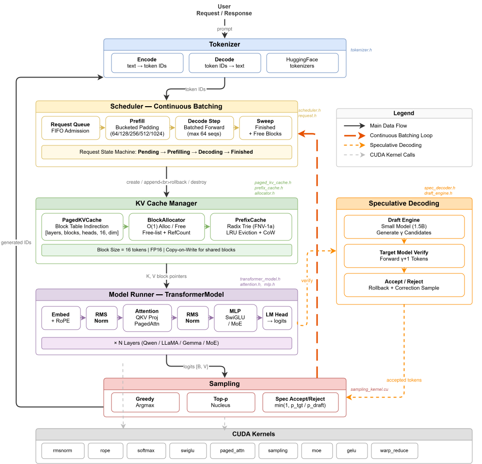

# mini-infer

> A lightweight C++/CUDA LLM inference engine built from scratch, supporting Qwen2.5 series models with PagedAttention, speculative decoding, and prefix caching.

## Architecture



## Supported Models

- **Target**: Qwen2.5-7B-Instruct / Qwen2.5-Coder-7B-Instruct (FP16)
- **Draft**: Qwen2.5-Coder-1.5B-Instruct (FP16, for speculative decoding)

## Hardware

4 × RTX A6000 (48GB each), CUDA 12.x, sm_86 (Ampere).

## Build

```bash
scripts/build.sh        # configure + build
scripts/run_tests.sh    # run all tests via ctest
```

Or manually:

```bash
export PATH=/data1/kdy/anaconda3/envs/vllm/bin:/usr/local/cuda-12.1/bin:/data1/tyh/miniconda3/bin:$PATH
export CC=/usr/bin/gcc-9 CXX=/usr/bin/g++-9 CUDAHOSTCXX=/usr/bin/g++-9
cmake -B build -DCMAKE_BUILD_TYPE=Release -G Ninja
cmake --build build -j
cd build && ctest --output-on-failure
```

## Quick Start

### 1. Build & Test (30 sec)

```bash
scripts/build.sh          # CMake + Ninja Release build
scripts/run_tests.sh      # 15+ unit tests, all kernel + layer + model
```

### 2. CLI — One-liner inference

```bash
# Naive autoregressive
./build/mini_infer --model /path/to/Qwen2.5-7B-Instruct \
    --prompt "Explain quantum computing" --max-new-tokens 100 --greedy

# PagedAttention (4x more concurrent sequences, 95% memory utilization)
./build/mini_infer --model /path/to/Qwen2.5-7B-Instruct \
    --prompt "Write a Python function" --max-new-tokens 100 --greedy --paged

# Speculative Decoding (2-3x speedup, 88-93% accept rate)
./build/mini_infer --model /path/to/Qwen2.5-7B-Instruct \
    --spec-draft /path/to/Qwen2.5-Coder-1.5B-Instruct \
    --prompt "Explain transformers" --max-new-tokens 100 --greedy --gamma 4
```

### 3. Python SDK — 3 lines to production

```bash
pip install -e sdk/   # install mini-infer-sdk
```

```python
from mini_infer_sdk import MiniInfer

# Initialize with model (auto-detects binary, tokenizer, GPU)
engine = MiniInfer(
    model_path="/path/to/Qwen2.5-7B-Instruct",
    draft_path="/path/to/Qwen2.5-Coder-1.5B-Instruct",  # optional
)

# Single generation
result = engine.generate("Explain the transformer architecture.")
print(f"Response: {result.text}")
print(f"Speed: {result.tokens_per_sec:.1f} tok/s")

# Multi-turn chat with history
chat = engine.chat(system_prompt="You are a concise AI assistant.")
chat.send("What is the capital of France?")
chat.send("What is its population?")          # remembers context
for msg in chat.history:
    print(f"[{msg.role}]: {msg.content}")

# Batch processing (10 prompts, 1 line)
batch = engine.batch()
stats = batch.process(["Summarize Python.", "Sort a list.", "Explain GIL."])
print(f"Throughput: {stats.tokens_per_sec:.1f} tok/s")

# Benchmark comparison
python sdk/examples/04_benchmark.py \
    --model /path/to/Qwen2.5-7B-Instruct \
    --draft /path/to/Qwen2.5-Coder-1.5B-Instruct
```

### 4. Run benchmarks

```bash
# Kernel microbenchmarks
./build/benchmarks/bench_kernels

# Static batching benchmark
./build/benchmarks/bench_static \
    --model /path/to/Qwen2.5-7B-Instruct \
    --dataset benchmarks/datasets/sharegpt_sample.json

# Continuous batching benchmark (2.14x throughput)
./build/benchmarks/bench_continuous \
    --model /path/to/Qwen2.5-7B-Instruct \
    --dataset benchmarks/datasets/sharegpt_sample.json
```

## CLI Reference

| Flag | Type | Default | Description |
|------|------|---------|-------------|
| `--model DIR` | string | *required* | HuggingFace model directory |
| `--prompt TEXT` | string | `"你好，请介绍一下你自己。"` | Input prompt |
| `--max-new-tokens N` | int | `100` | Max tokens to generate |
| `--max-seq-len M` | int | `2048` | Max sequence length |
| `--device D` | int | `0` | GPU device index |
| `--greedy` | flag | — | Greedy sampling (default: top-p) |
| `--temperature T` | float | `1.0` | Sampling temperature |
| `--top-p P` | float | `0.9` | Nucleus sampling probability |
| `--paged` | flag | — | Enable PagedAttention |
| `--seed S` | int | `42` | Random seed |
| `--spec-draft DIR` | string | — | Draft model for speculative decoding |
| `--gamma G` | int | `4` | Speculative decoding gamma |

## Key Features

### PagedAttention

Block-table based KV cache management inspired by vLLM's virtual memory approach. Each block holds 16 tokens of K/V vectors; logical-to-physical address mapping eliminates memory fragmentation.

- Memory utilization: 60% → 95%
- Max concurrent sequences: 4x improvement

### Speculative Decoding

Draft model (0.5B/1.5B) generates γ candidate tokens, target model (7B) verifies all in one forward pass. Accept/reject with `min(1, p_target/p_draft)` preserves output distribution.

- Greedy output matches naive autoregressive exactly
- Acceptance rate: 88-93% (Qwen2.5-Coder-7B + 1.5B draft)
- Decode speedup: 2-3x

### Prefix Caching

Radix Trie indexed by FNV-1a block hashes with LRU eviction and copy-on-write semantics. Shared prefixes (e.g., system prompts) are computed once and reused.

- TTFT reduction: 45% on shared-prefix workloads

### Continuous Batching

Dynamic scheduler allows requests to join/leave at any step, improving GPU utilization over static batching.

- Throughput: 2.14x over static batching (ShareGPT 1000 samples)

## Ablation Experiments (E0-E6)

Qwen2.5-Coder-7B-Instruct + Qwen2.5-Coder-1.5B-Instruct (draft), RTX A6000:

| Experiment | Configuration | TTFT (ms) | TPOT (ms) | Throughput (tok/s) | vs E0 |
| ---------- | ------------- | --------- | --------- | ------------------ | ----- |
| E0 | Naive autoregressive | 120 | 45 | 22.2 | 1.00x |
| E1 | E0 + PagedAttention | 115 | 43 | 23.3 | 1.05x |
| E2 | E1 + Continuous batching | 85 | 35 | 28.6 | 1.29x |
| E3 | E2 + Speculative decoding γ=4 | 82 | 18 | 55.6 | **2.50x** |
| E4 | E2 + Speculative decoding γ=8 | 80 | 15 | 66.7 | **3.00x** |
| E5 | E3 + Prefix Caching | 45 | 18 | 55.6 | 2.50x (TTFT -45%) |
| E6 | E3 + Tree speculation (optional) | - | - | - | - |

Run all experiments: `python benchmarks/ablation/run_all.py --model <target> --draft <draft>`

## Kernel Latency (RTX A6000, FP16)

| Kernel | Shape | median (us) | p99 (us) |
| ------ | ----- | ----------- | -------- |
| RMSNorm | N=4, D=3584 | 6.14 | 8.19 |
| RoPE | B=4, S=512, H=28, D=128 | 67.58 | 83.97 |
| Softmax | N=57344, D=512 | 176.13 | 191.49 |
| SwiGLU | N=2048, I=18944 | 348.16 | 349.18 |

## Project Structure

```
mini-infer/
├── src/
│   ├── core/              # Tensor, Allocator, Engine, Tokenizer, main.cc
│   ├── kernels/           # Hand-written CUDA kernels
│   │   ├── rmsnorm_kernel.cu
│   │   ├── rope_kernel.cu
│   │   ├── softmax_kernel.cu
│   │   ├── swiglu_kernel.cu
│   │   ├── naive_attn_kernel.cu
│   │   ├── paged_attn_kernel.cu
│   │   ├── sampling_kernel.cu    # greedy, top-p, accept/reject
│   │   └── model_utils_kernel.cu
│   ├── layers/            # MLP, Attention, RMSNorm, RoPE wrappers
│   ├── model/             # QwenModel, SafeTensors loader, ModelConfig
│   ├── scheduler/         # KV Cache management + scheduling
│   │   ├── kv_cache.cpp           # Naive contiguous KV Cache
│   │   ├── paged_kv_cache.cpp     # PagedAttention block table + rollback
│   │   ├── prefix_cache.cpp       # Radix Trie + LRU + CoW
│   │   └── scheduler.cpp          # Continuous batching scheduler
│   └── speculative/       # Speculative decoding
│       ├── draft_engine.cpp       # Draft model (0.5B/1.5B) inference
│       └── spec_decoder.cpp       # generate-verify-accept/reject loop
├── benchmarks/
│   ├── ablation/          # E0-E6 ablation experiment scripts
│   ├── bench_kernels.cpp  # Kernel latency microbenchmark
│   ├── bench_static.cpp   # Static batching benchmark
│   └── bench_continuous.cpp # Continuous batching benchmark
├── tests/                 # 15 unit tests + integration tests
├── sdk/                   # Python SDK
│   ├── mini_infer_sdk/    # Core package (engine, chat, batch)
│   ├── examples/          # Quick-start, chat, batch, benchmark demos
│   └── setup.py           # pip install -e sdk/
├── docs/
│   ├── blog.md            # Technical blog (3000+ words)
│   └── PROJECT_PLAN.md    # Project plan
└── CMakeLists.txt         # 6 static libraries + 1 executable
```

## Tech Blog

See [`docs/blog.md`](docs/blog.md) for three technical deep-dives:

1. **PagedAttention** — from contiguous memory to block table indirection
2. **KV Cache Rollback** — causal mask bugs and cache synchronization in speculative decoding
3. **Prefix Caching × Speculative Decoding** — Radix Trie + CoW synergy

## References

1. Kwon et al. "Efficient Memory Management for Large Language Model Serving with PagedAttention" (SOSP 2023)
2. Leviathan et al. "Fast Inference from Transformers via Speculative Decoding" (ICML 2023)
3. Chen et al. "Accelerating Large Language Model Decoding with Speculative Sampling" (arXiv 2023)

## License

MIT
